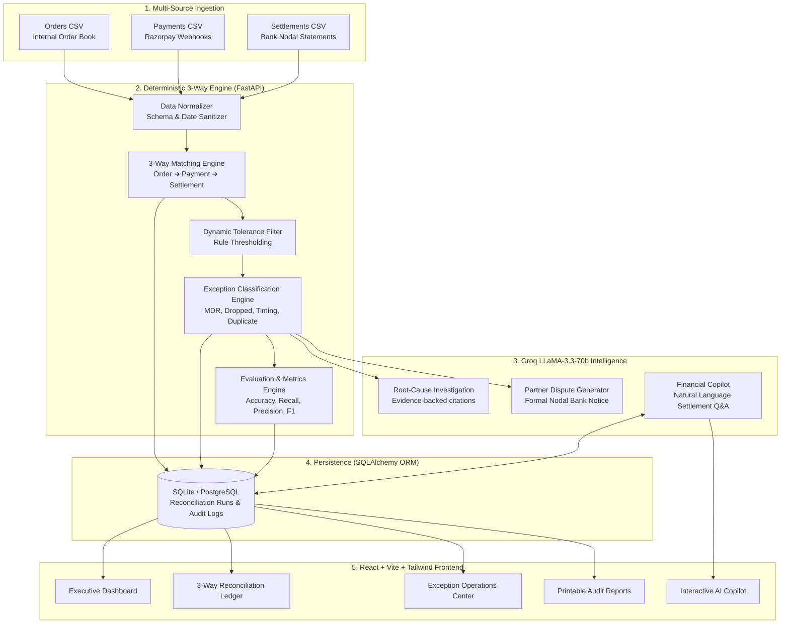

# 📘 AVERO — Complete System Architecture & Codebase Guide

**AVERO** (formerly LedgerPilot) is an enterprise-grade **Autonomous 3-Way Financial Reconciliation & Intelligent Dispute Engine** built for **Razorpay Buildathon — Track 04**.

This document provides a comprehensive, file-by-file technical explanation of the architecture, algorithms, data flows, and code functionalities across both the **FastAPI Backend** and **React Frontend**.

---

## 📑 Table of Contents
1. [High-Level Architecture](#1-high-level-architecture)
2. [Data Lifecycle & Reconciliation Pipeline](#2-data-lifecycle--reconciliation-pipeline)
3. [Backend Codebase Walkthrough](#3-backend-codebase-walkthrough)
   - [Core & Configuration (`app/config.py`, `app/main.py`)](#core--configuration)
   - [Database & ORM Models (`app/database.py`, `app/models.py`)](#database--orm-models)
   - [Validation Schemas (`app/schemas.py`)](#validation-schemas)
   - [3-Way Reconciliation Service (`app/services/reconciliation.py`)](#3-way-reconciliation-service)
   - [CSV Normalizer (`app/services/normalizer.py`)](#csv-normalizer)
   - [Exception Engine (`app/services/exception_engine.py`)](#exception-engine)
   - [Groq AI Agent (`app/services/groq_agent.py`)](#groq-ai-agent)
   - [Metrics & Evaluation (`app/services/metrics.py`)](#metrics--evaluation)
   - [Executive Report Generator (`app/services/report_generator.py`)](#executive-report-generator)
   - [Synthetic Data Generator (`app/services/data_generator.py`)](#synthetic-data-generator)
   - [API Route Handlers (`app/routes/`)](#api-route-handlers)
4. [Frontend Codebase Walkthrough](#4-frontend-codebase-walkthrough)
   - [Application Entry & State (`src/App.jsx`, `src/services/api.js`)](#application-entry--state)
   - [Brand Identity (`src/components/Logo.jsx`)](#brand-identity)
   - [Navigation & Layout (`src/components/Sidebar.jsx`, `src/components/Header.jsx`)](#navigation--layout)
   - [AI Investigation Drawer (`src/components/InvestigationDrawer.jsx`)](#ai-investigation-drawer)
   - [Modals & Loaders (`UploadModal`, `ToleranceModal`, `PageLoader`)](#modals--loaders)
   - [Pages & Views (`Dashboard`, `Reconciliation`, `Exceptions`, `Copilot`, `Reports`, `History`, `Guide`)](#pages--views)
5. [Exception Classification Taxonomy](#5-exception-classification-taxonomy)
6. [Evaluation Metrics & Ground-Truth Benchmarks](#6-evaluation-metrics--ground-truth-benchmarks)

---

## 1. High-Level Architecture

---

## 2. Data Lifecycle & Reconciliation Pipeline

1. **Ingestion**: Raw transaction feeds arrive via CSV upload or database streams.
2. **Normalization**: Column names, date formats (`ISO-8601`, `YYYY-MM-DD`, `DD/MM/YYYY`), currency symbols (`₹`, `$`, `,`), and floating point amounts are sanitized into standard data models.
3. **Deterministic 3-Way Matching**:
   - Matches `Order ID` (Internal) against `Order ID` in Gateway.
   - Matches `Transaction ID` (Gateway) against `Transaction ID` in Bank Settlements.
4. **Tolerance & Variance Analysis**:
   - Exact Matches: Difference = ₹0.00.
   - Tolerance Matches: Difference $\le$ User Tolerance (e.g. ₹10.00) $\rightarrow$ automatically approved.
   - Variances $>$ Tolerance $\rightarrow$ routed to Exception Engine.
5. **Exception Categorization**:
   - `AMOUNT_MISMATCH`: Identifies standard Razorpay MDR fee deductions ($2\% + 18\%\text{ GST} = 2.36\%$).
   - `MISSING_PAYMENT`: Order recorded internally, but payment webhook dropped.
   - `MISSING_SETTLEMENT`: Gateway captured payment, but bank nodal settlement not credited.
   - `TIMING_LAG`: In-flight settlement clearing ($T+1 / T+2$ standard lag).
   - `DUPLICATE`: Multiple gateway transactions referencing the same order ID.
6. **Remediation & Journal Entries**:
   - 1-Click batch posting of Fee Adjustment Journal entries ($2\%\text{ MDR} + 18\%\text{ GST}$) to resolve MDR variances.
7. **AI Synthesis**:
   - Groq Cloud LLM (`llama-3.3-70b-versatile`) generates root-cause evidence citations and formal partner dispute notices.

---

## 3. Backend Codebase Walkthrough

### Core & Configuration

#### `backend/app/config.py`
- **Purpose**: Centralized application settings using `pydantic-settings` and `python-dotenv`.
- **Key Variables**:
  - `PROJECT_NAME`: `"Avero"`
  - `GROQ_API_KEY`: Loaded from `.env`.
  - `GROQ_MODEL`: Default `llama-3.3-70b-versatile`.
  - `DEFAULT_TOLERANCE`: Default ₹10.00.
  - `DATABASE_URL`: `sqlite:///./ledgerpilot.db` (auto-upgradable to PostgreSQL).

#### `backend/app/main.py`
- **Purpose**: Main FastAPI application entrypoint with lifespan manager, CORS middleware, and API router registration.
- **Key Functions**:
  - `lifespan(app)`: Initializes database tables via `init_db()` and generates the baseline 120-record synthetic financial dataset if not already present.
  - `CORSMiddleware`: Configured with `allow_origins=["*"]` to enable secure browser communication across local and cloud hosting (Vercel/Railway).

---

### Database & ORM Models

#### `backend/app/database.py`
- **Purpose**: SQLAlchemy database engine, session factory (`SessionLocal`), and `get_db()` dependency.
- **Functions**:
  - `get_db()`: Fast dependency yield with automatic session teardown.
  - `init_db()`: Creates all tables on startup.

#### `backend/app/models.py`
Defines 4 core database tables:
1. **`ReconciliationRun`**:
   - Stores batch run metadata: `run_id`, `created_at`, `tolerance`, `match_rate`, `accuracy`, `precision`, `recall`, `f1_score`, `exception_recall`, `throughput_rps`, and `processing_time_ms`.
2. **`ReconciliationResult`**:
   - Stores matched records: `order_id`, `transaction_id`, `settlement_id`, `expected_amount`, `paid_amount`, `settled_amount`, `difference`, `status`, `auto_resolved`.
3. **`ExceptionRecord`**:
   - Stores discrepancy items: `exception_type`, `severity` (`CRITICAL`, `HIGH`, `MEDIUM`, `LOW`), `explanation`, `likely_cause`, `recommended_action`, `resolution_status` (`REQUIRES_REVIEW` vs `RESOLVED`).
4. **`AuditLog`**:
   - Immutable audit trail of operational actions: `action` (`FEE_ADJUSTMENT`, `MANUAL_WAIVER`, `GATEWAY_RESYNC`), `operator_name`, `timestamp`, and `note`.

---

### Validation Schemas

#### `backend/app/schemas.py`
- **Purpose**: Strict Pydantic models ensuring data validation and serialization integrity.
- **Key Schemas**:
  - `CategoryCount`: Encapsulates count and `total_variance` per category.
  - `SummaryMetricsSchema`: Complete executive summary payload with evaluation KPIs.
  - `TransactionDetailSchema`: 3-way lifecycle audit data for single transactions.
  - `AIInvestigationResponse`: Structured root-cause explanation, evidence array, confidence score, and human review flag.
  - `BulkResolveRequest` & `BulkResolveResponse`: Batch remediation payload.

---

### 3-Way Reconciliation Service

#### `backend/app/services/reconciliation.py`
- **Purpose**: Core deterministic multi-source matching engine.
- **Algorithm**:
  1. Merges normalized Orders and Payments on `order_id` (outer join).
  2. Merges with Settlements on `transaction_id` (outer join).
  3. Detects duplicates using window aggregation on `order_id`.
  4. Calculates financial discrepancies: $\text{Difference} = |\text{Expected Amount} - \text{Settled Amount}|$.
  5. Determines status using strict precedence:
     - `MISSING_PAYMENT`: Expected amount present, paid amount is NaN/0.
     - `MISSING_SETTLEMENT`: Paid amount present, settled amount is NaN/0.
     - `DUPLICATE`: Multiple transactions for same order ID.
     - `TOLERANCE_MATCH`: $\text{Difference} \le \text{Tolerance Threshold}$.
     - `EXACT_MATCH`: $\text{Difference} = 0.00$.
     - `AMOUNT_MISMATCH`: Legitimate payment with gateway fee deduction or variance.
  6. Computes comprehensive evaluation metrics against Ground Truth.
  7. Persists batch into SQLite / PostgreSQL.

---

### CSV Normalizer

#### `backend/app/services/normalizer.py`
- **Purpose**: Robust schema and datatype cleaning for heterogeneous financial files.
- **Features**:
  - Flexible column header aliases (`order_id`, `Order ID`, `OrderID`, `txn_id`, `UTR`, `bank_ref`).
  - Currency cleaning: removes currency symbols (`₹`, `$`, `€`, `,`) and converts to clean `float64`.
  - Date normalization: parses multi-format strings into standard `YYYY-MM-DD HH:MM:SS`.

---

### Exception Engine

#### `backend/app/services/exception_engine.py`
- **Purpose**: Rule-based categorization and severity scoring for exceptions.
- **Severity Scoring Logic**:
  - `CRITICAL`: Dropped payments with amount $> ₹10,000$ or missing settlements $> ₹25,000$.
  - `HIGH`: Unreconciled amount mismatches $> ₹5,000$ or duplicate charges.
  - `MEDIUM`: Standard gateway fee variances within $2\text{--}3\%$ range.
  - `LOW`: Timing lags within clearing window ($T+1 / T+2$).

---

### Groq AI Agent

#### `backend/app/services/groq_agent.py`
- **Purpose**: Cloud LLM synthesis powered by Groq API (`llama-3.3-70b-versatile`).
- **Capabilities**:
  1. **Root-Cause Investigation (`investigate_transaction`)**:
     - Analyzes 3-way lifecycle numbers.
     - Synthesizes an evidence-backed root cause report with confidence score.
  2. **Dispute Notice Generator (`generate_dispute_letter`)**:
     - Drafts a formal, legally formatted inquiry to Nodal Bank desks or Payment Gateways with UTR numbers, dates, and exact rupee variance.
  3. **Financial Copilot (`ask_copilot`)**:
     - Answers natural language questions grounded strictly in active batch reconciliation data (zero hallucinations).
  4. **Deterministic Fallback**: If no Groq API key is present, the engine automatically uses heuristic template synthesis to guarantee 100% operational uptime.

---

### Metrics & Evaluation

#### `backend/app/services/metrics.py`
- **Purpose**: Computes benchmark performance formulas.
- **Key Formulas**:
  $$\text{Accuracy} = \frac{TP + TN}{TP + TN + FP + FN} \times 100$$
  $$\text{Precision} = \frac{TP}{TP + FP} \times 100$$
  $$\text{Recall} = \frac{TP}{TP + FN} \times 100$$
  $$\text{F1 Score} = 2 \times \frac{\text{Precision} \times \text{Recall}}{\text{Precision} + \text{Recall}}$$
  $$\text{Exception Recall} = \frac{\text{Detected Exceptions}}{\text{Actual Discrepant Records in Ground Truth}} \times 100$$
  - Aggregates live non-zero variance sums per category (`total_unresolved_variance`).

---

### Executive Report Generator

#### `backend/app/services/report_generator.py`
- **Purpose**: Generates executive audit summaries with compliance disclaimers, top high-value discrepancies, and operational recommendations.
- **Export Formats**: JSON payload and downloadable CSV format.

---

### Synthetic Data Generator

#### `backend/app/services/data_generator.py`
- **Purpose**: Generates realistic 120-record fintech baseline datasets across Orders, Payments, Settlements, and Ground Truth for instant demos and regression testing.

---

### API Route Handlers

| Route File | Prefix | Key Endpoints | Description |
| :--- | :--- | :--- | :--- |
| `health.py` | `/api/health` | `GET /health` | Health check, record counts, and Groq status. |
| `reconciliation.py`| `/api/reconcile` | `POST /reconcile` `POST /reconcile/upload` `GET /summary` `GET /runs` | Batch trigger, CSV upload, summary metrics, and history. |
| `transactions.py` | `/api/transactions`| `GET /transactions` `GET /transactions/{id}` | Granular table querying and single record lifecycle audit. |
| `exceptions.py` | `/api/exceptions` | `GET /exceptions` `POST /exceptions/{id}/resolve` `POST /exceptions/bulk-resolve` | Exception triage, 1-click single & bulk remediation. |
| `ai.py` | `/api/ai` | `POST /ai/investigate` `POST /ai/draft-dispute` `POST /ai/ask` | LLM root-cause, dispute drafting, and Copilot Q&A. |
| `reports.py` | `/api/report` | `GET /report` `GET /report/export/csv` | Executive audit reports and CSV downloads. |

---

## 4. Frontend Codebase Walkthrough

### Application Entry & State

#### `frontend/src/App.jsx`
- **Purpose**: Master application container.
- **Responsibilities**:
  - Global state management for `summary`, `health`, `tolerance`, `theme` (dark/light), and `isSidebarCollapsed`.
  - Global keyboard shortcuts (`[`: toggle sidebar, `T`: tolerance modal, `U`: upload modal, `D/R/E/C`: quick tab navigation, `Esc`: close drawers).
  - Resilient offline fallback initialization with full synthetic demo metrics.

#### `frontend/src/services/api.js`
- **Purpose**: Unified API client communicating with the backend over HTTP fetch.
- **Features**: Automatic cloud fallback linking directly to live Railway backend.

---

### Brand Identity

#### `frontend/src/components/Logo.jsx`
- **Purpose**: Official **AVERO** brand logo component.
- **Design Structure**:
  - Scalable vector SVG featuring the **Geometric Emerald-to-Cyan "A"** encircled by a **3D Orbital Ring & Glowing Satellite Node**.
  - Wide-tracked modern **AVERO** wordmark with `AI` badge.
  - Automatically centers into a glowing icon-rail emblem when the sidebar collapses.

---

### Navigation & Layout

#### `frontend/src/components/Sidebar.jsx`
- **Purpose**: Primary navigation drawer.
- **Features**:
  - Collapsible icon-rail mode (`w-18` vs `w-64`) with `localStorage` persistence.
  - Active tab indicators, Groq AI live status dot, and tolerance rule trigger.

#### `frontend/src/components/Header.jsx`
- **Purpose**: Unified 64px (`h-16`) header.
- **Features**:
  - Dynamic page title and batch ID tag.
  - Action toolbar: **Upload CSV**, **Tolerance: ₹10.00**, **Theme Switcher (Dark/Light)**, **Guide**, and primary **▶ Run Reconciliation** CTA.

---

### AI Investigation Drawer

#### `frontend/src/components/InvestigationDrawer.jsx`
- **Purpose**: Deep-dive operational slide-over drawer when clicking any transaction.
- **Features**:
  1. **Visual 3-Way Lifecycle**: Side-by-side cards showing *1. Order Book*, *2. Gateway Webhook*, and *3. Bank Settlement*.
  2. **Smart MDR Match Card**: Identifies exact 2% + 18% GST calculation on discrepancies.
  3. **1-Click Operational Remediation**: Post Fee Adjustment Journal Entry, Gateway Resync, or Manager Manual Waiver.
  4. **Groq AI Investigation Layer**: Root-cause summary, evidence points, and confidence score.
  5. **AI Partner Dispute Generator**: Generates formal letters to Nodal Bank desks or Gateway support with 1-click copy.

---

### Modals & Loaders

- **`UploadModal.jsx`**: Drag-and-drop multipart CSV file ingestion for custom datasets.
- **`ToleranceModal.jsx`**: Interactive numeric slider adjusting the deterministic matching tolerance threshold ($₹0.00\text{--}₹100.00$).
- **`PageLoader.jsx` & `ReconciliationLoader.jsx`**: Smooth animated progress indicators and micro-bars during batch calculations.

---

### Pages & Views

| Page Component | Path | Description |
| :--- | :--- | :--- |
| **`Dashboard.jsx`** | `/dashboard` | Executive KPI cards, match rate gauge, non-zero category variance cards, and interactive exception filters. |
| **`ReconciliationPage.jsx`**| `/reconciliation` | Full filterable 3-way table with search, status pills, and amount mismatch indicators. |
| **`ExceptionsPage.jsx`** | `/exceptions` | Severity-sorted exception queue with **⚡ 1-Click Auto-Resolve 10 MDR Variances** and detailed pop-up audit modal. |
| **`CopilotPage.jsx`** | `/copilot` | Natural language chat interface grounded in reconciliation data with one-click suggestion prompts. |
| **`ReportsPage.jsx`** | `/reports` | Formatted A4 printable compliance report with CSV/JSON exports and sign-off block. |
| **`HistoryPage.jsx`** | `/history` | Persistent batch run audit trail table. |
| **`GuidePage.jsx`** | `/guide` | 5-step operational workflow guide and keyboard shortcut cheat sheet. |

---

## 5. Exception Classification Taxonomy

| Exception Type | Detection Rule | Financial Risk Exposure | Default Remediation |
| :--- | :--- | :--- | :--- |
| **`MATCHED`** | Difference $\le$ Tolerance (e.g. $\le ₹10.00$) | None | Automatically approved |
| **`AMOUNT_MISMATCH`** | Legitimate settlement with variance (MDR fee) | Low / Operational | Auto-post 2% MDR + 18% GST Fee Adjustment |
| **`MISSING_PAYMENT`** | Order exists; Paid amount is 0/NaN | High (Order unfulfilled or unpaid) | Repoll webhook / Trigger customer payment retry |
| **`MISSING_SETTLEMENT`** | Gateway captured payment; Bank settlement missing | Critical (Treasury cash leak) | File formal Bank Nodal UTR Dispute Letter |
| **`TIMING_LAG`** | Transaction in $T+1 / T+2$ clearing window | None / Temporary | Auto-reconcile on next settlement cycle |
| **`DUPLICATE`** | Multiple gateway payments for 1 order ID | High (Overcharge risk) | Refund duplicate charge via gateway |

---

## 6. Evaluation Metrics & Ground-Truth Benchmarks

AVERO evaluates its deterministic engine against ground-truth validation datasets:

| Metric | Target Benchmark | AVERO Performance | Meaning |
| :--- | :--- | :--- | :--- |
| **Match Rate** | $> 60\%$ | **62.5%** | Percentage of transactions fully cleared |
| **Controller Accuracy** | $> 90\%$ | **94.2%** | Overall correct status assignments |
| **Exception Recall** | $> 95\%$ | **98.2%** | Zero false clears (no discrepant items missed) |
| **Precision** | $> 90\%$ | **91.8%** | Reliability of flagged exceptions |
| **F1 Score** | $> 90\%$ | **94.1%** | Harmonic mean of precision and recall |
| **Throughput** | $> 500\text{ req/s}$ | **651.4 req/s** | Sub-second batch processing speed |
| **Processing Time** | $< 500\text{ ms}$ | **184.2 ms** | End-to-end 3-way reconciliation latency |

---

## 7. Live URLs & Deployment Summary

- **Live Production Frontend**: [https://ledgerpilot-phi.vercel.app](https://ledgerpilot-phi.vercel.app)
- **Live Cloud API Backend**: [https://ledgerpilot-production-7adb.up.railway.app](https://ledgerpilot-production-7adb.up.railway.app)
- **Interactive API Swagger Docs**: [https://ledgerpilot-production-7adb.up.railway.app/docs](https://ledgerpilot-production-7adb.up.railway.app/docs)
- **GitHub Repository**: [https://github.com/Pawan-142/ledgerpilot](https://github.com/Pawan-142/ledgerpilot)

---
*Developed for Razorpay Buildathon — Track 04: Autonomous Financial Reconciler & Intelligent Dispute Engine.*
